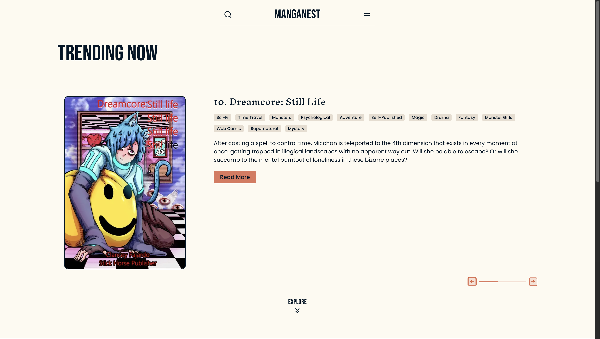
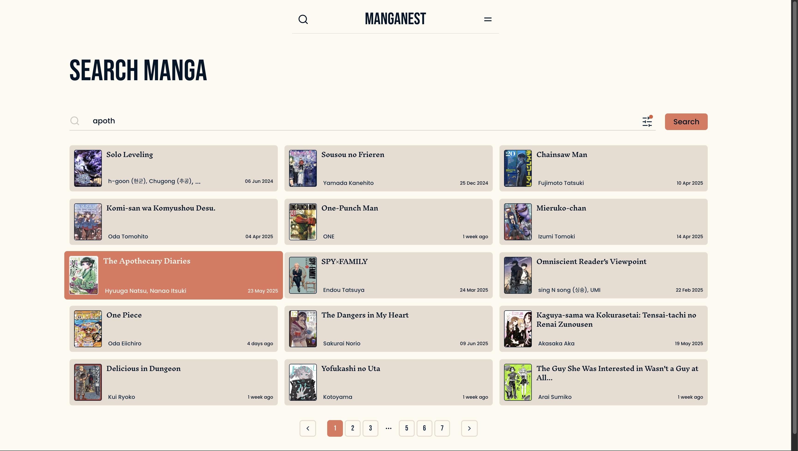
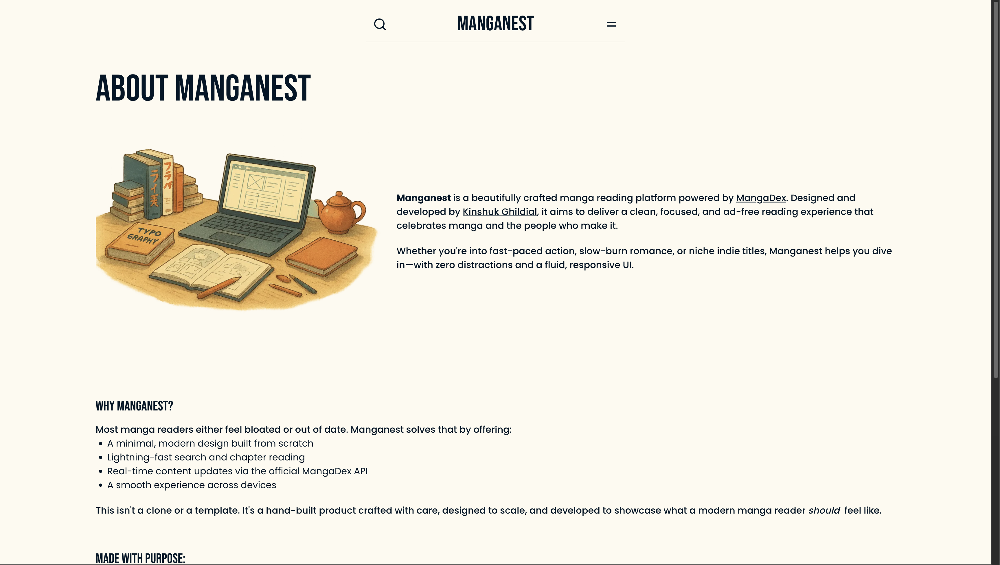
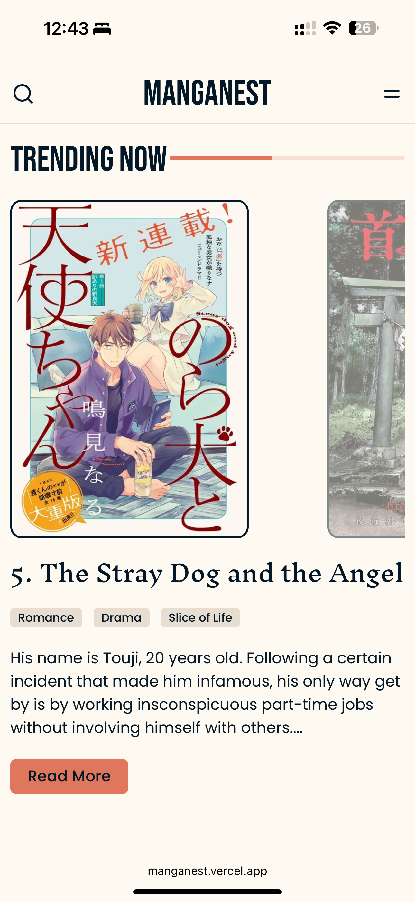
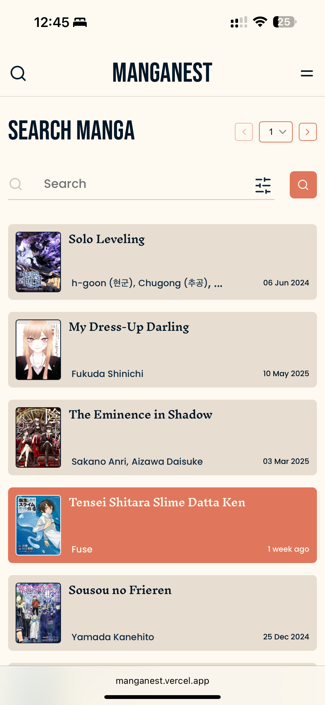
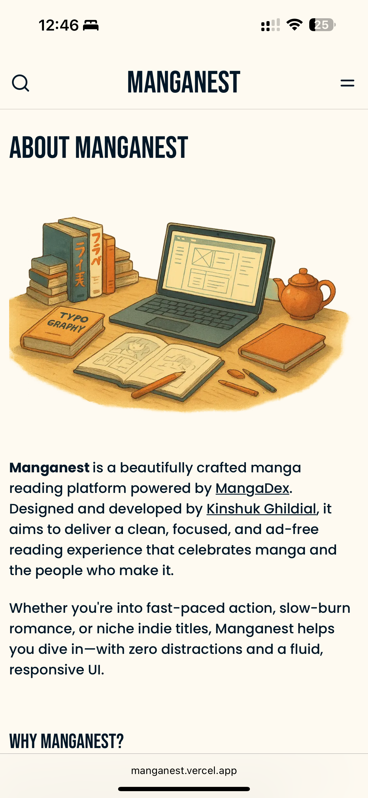
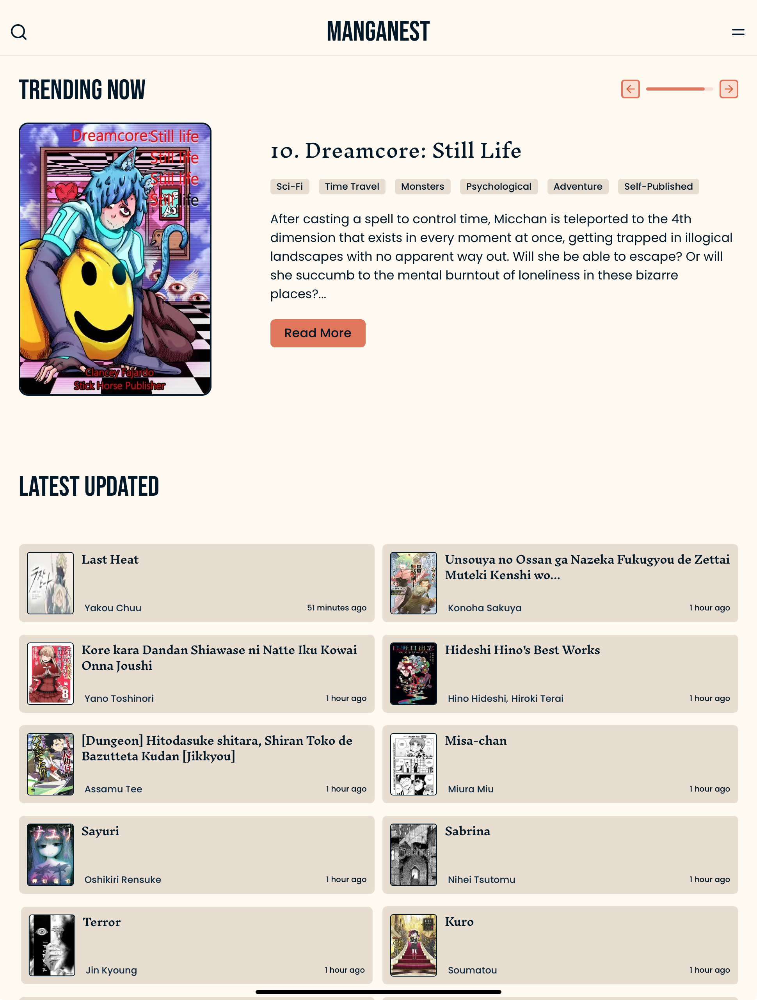

# Manganest

Manganest is designed to be a clean, ad-free manga reading platform that celebrates the medium and the people who make it — with a focus on zero distractions, thoughtful UI, and responsive performance.

It is built as a full-stack manga reader from scratch — ideated and designed the UI & UX in Figma, developed the platform using Next.js, React Server Components , ShadCN, Tailwind, Framer Motion, and integrated a custom backend proxy layer for the MangaDex API.
Focused on delivering a clean, minimal reading experience with SSR, and real-time content rendering.

Live Preview:
https://manganest.vercel.app

# Glimpses:

### Desktop:

<div>
  <a href="src/assets/images/docs/manganest_home_desktop.png"></a>
  <a href="src/assets/images/docs/manganest_search_desktop.png"></a>
  <a href="src/assets/images/docs/manganest_about_desktop.png"></a>

</div>

### Mobile:

<div>
  <a href="src/assets/images/docs/manganest_home_mobile.png"></a>
  <a href="src/assets/images/docs/manganest_search_mobile.png"></a>
    <a href="src/assets/images/docs/manganest_about_mobile.png"></a>
</div>

### Tablet:

<div>
  <a href="src/assets/images/docs/manganest_home_tablet.jpeg"></a>
</div>

<br />
<br />
<br />

This is a [Next.js](https://nextjs.org) project bootstrapped with [`create-next-app`](https://nextjs.org/docs/app/api-reference/cli/create-next-app).

## Getting Started

First, run the development server:

```bash
npm run dev
# or
yarn dev
# or
pnpm dev
# or
bun dev
```

Open [http://localhost:3000](http://localhost:3000) with your browser to see the result.

You can start editing the page by modifying `app/page.tsx`. The page auto-updates as you edit the file.

This project uses [`next/font`](https://nextjs.org/docs/app/building-your-application/optimizing/fonts) to automatically optimize and load [Geist](https://vercel.com/font), a new font family for Vercel.

## Learn More

To learn more about Next.js, take a look at the following resources:

- [Next.js Documentation](https://nextjs.org/docs) - learn about Next.js features and API.
- [Learn Next.js](https://nextjs.org/learn) - an interactive Next.js tutorial.

You can check out [the Next.js GitHub repository](https://github.com/vercel/next.js) - your feedback and contributions are welcome!

## Deploy on Vercel

The easiest way to deploy your Next.js app is to use the [Vercel Platform](https://vercel.com/new?utm_medium=default-template&filter=next.js&utm_source=create-next-app&utm_campaign=create-next-app-readme) from the creators of Next.js.

Check out our [Next.js deployment documentation](https://nextjs.org/docs/app/building-your-application/deploying) for more details.
